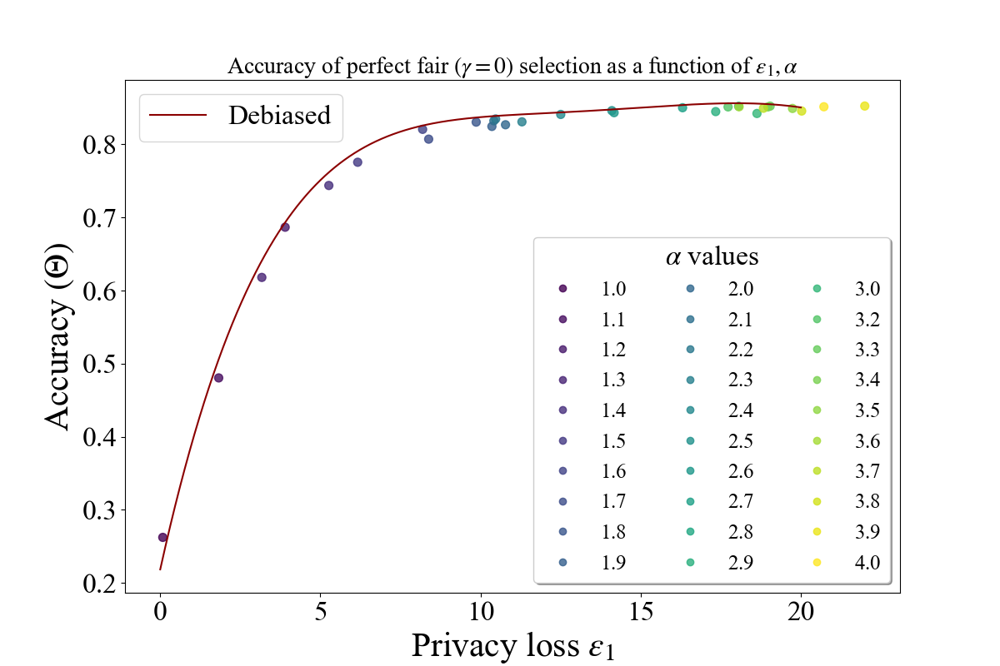

# Perfect_fair_selection

## Adult income dataset using White and Black as sensitive attributes

The debiased model trained with the following parameters:

num_epochs = 5 

adversary_loss_weight = 1 

batch_size = 5 
### Acuraccy as a function of $\epsilon$ when we have perfect fairness

### Accuracy as a function of $\epsilon$

### Fairness as a function of $\epsilon$
 

## FICO credit score dataset using White and Black as sensitive attributes

The debiased model trained with the following parameters:

num_epochs = 3 

adversary_loss_weight = 1 

batch_size = 250

### Acuraccy as a function of $\epsilon$ when we have perfect fairness

### Accuracy as a function of $\epsilon$

### Fairness as a function of $\epsilon$
 

## FICO credit score dataset using White+Hispanic and Asian as sensitive attributes

The debiased model trained with the following parameters:

num_epochs = 5 

adversary_loss_weight = 1 

batch_size = 200

### Acuraccy as a function of $\epsilon$ when we have perfect fairness

### Accuracy as a function of $\epsilon$

### Fairness as a function of $\epsilon$
 

## LSAT dataset using White and Black as sensitive attributes

The debiased model trained with the following parameters:

num_epochs = 7

adversary_loss_weight = 3 

batch_size = 50

### Acuraccy as a function of $\epsilon$ when we have perfect fairness

### Accuracy as a function of $\epsilon$

### Fairness as a function of $\epsilon$
 
